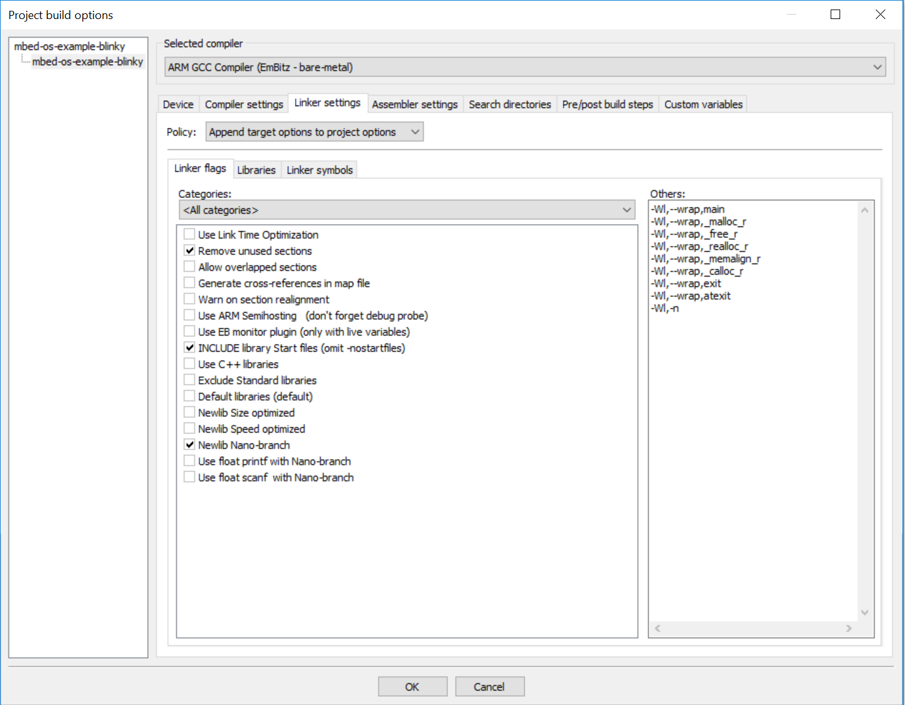

# MANIstm

The repository for the code that runs on MANIs STM32 microcontrollers.

## Overview

All main controller and sensor readout tasks are completed using BluePill (STM32F103C8T6) boards.

## PID Control

This Code is based on a software PID controller implementation

### Tuning

The tuning parameters have been empirically determined and are hardcoded into the library.
Further fine tuning will be performed on the final rover setup.

## Datasheets

Information about the motor and encoder can be found at: https://www.pololu.com/product/1440
The encoder maximal precision is 64 counts per revolution on counting every rising and falling edge on both channels (X4_ENCODING).
This results in 8384 encoder pulses per revolution for the 131:1 gear ratio of the motors used on the rover for steering an driving.

All information about the BluePill (STM32F103C8T6) chip can be found at: https://www.st.com/resource/en/datasheet/stm32f103c8.pdf

The CAN transceiver used for the connection is the MCP2562 since it has a variable operating voltage for the Rxd and Txd pins: http://ww1.microchip.com/downloads/en/devicedoc/20005167c.pdf

Lastly the datasheet of the Jetson TX2 is located at: https://www.docdroid.net/yGXIxZu/data-sheet-nvidia-jetson-tx2-system-on-module.pdf

## Software Environment

The software to program the STM chips is written in C and C++.
The ARM Mbed platform was used as an abstraction layer. This considerably simplifies the code necessary to program the micro-controllers.
There are currently two versions of Mbed OS:
* Mbed OS 2 (https://os.mbed.com/users/mbed_official/code/mbed-dev/)
* Mbed OS 5 (https://github.com/armmbed/mbed-os)

Mbed OS 5 is a superset of Mbed OS 2, it expands the OS with further features such as the Mbed-RTOS. Both OS options are kept up to date and they both run on the BluePill (STM32F103C8T6). Mbed OS 2 runs on less storage than OS 5. Since the flash storage is limited to 64kB, the decision was made to revert to Mbed OS 2 and import any further needed features from Mbed OS 5. Hence allowing more possibilities to further expand the software if necessary.
Only the Mbed-RTOS (https://os.mbed.com/users/mbed_official/code/mbed-rtos/) was added, to use the threading for prioritised task execution.

### IDE

Multiple options for setting up an \IDE for working with Mbed exist. Probably the easiest is to use the [Mbed Online Compiler](https://ide.mbed.com), it is very simple and no further tools are required. The main drawback is that it does not allow debugging of the software.

The [BluePill example setup](https://os.mbed.com/users/hudakz/code/STM32F103C8T6_Hello/) gives a good overview of how to get started with Mbed and the micro-controllers. As far as offline compilers go, it also suggests [Mbed Studio](https://os.mbed.com/docs/mbed-studio/0.5/introduction/index.html) for Mbed OS 5 applications and [Qt Creator](https://os.mbed.com/users/hudakz/notebook/building-offline-with-qt-creator/) for Mbed OS 2 projects.

Personally I found that the best option, that provides all the benefits of an offline compiler such as debugging, was EmBitz. It is a very light weight \IDE for Windows. The program code can be downloaded using [Mbed CLI](https://os.mbed.com/docs/mbed-os/v5.13/tools/developing-mbed-cli.html) from an embitz repository and exported as an EmBitz project for the NUCLEO-F103RB (as described in the Bluepill example setup mentioned above).
Then the project simply has to opened using EmBitz and the code can be compiled to the BluePill using a NUCLEO or an ST-Link.

Though the build options in the \IDE the size of the compiled code can be considerably reduced. It is recomended using the nano-branch library and not enabling printf float if possible. The settings used can be taken from the image below.

### Libraries

This Code is based on multiple Mbed libraries that were adapted to our purpose:

* The Arduino PID library adjustment for arm: https://os.mbed.com/users/aberk/code/PID/

* The quadrature encoder class: https://os.mbed.com/users/aberk/code/QEI/

Since the code is run on the BluePill (STM32F103C8T6) the following files were imported into the project: https://os.mbed.com/users/hudakz/code/mbed-STM32F103C8T6/. Thereby only the "PinNames.h" file is included and the rest of the files might be removed to minimise flash storage used.

The Mbed CAN interface (part of Mbed OS) was used for the CAN bus connection: https://os.mbed.com/docs/mbed-os/v5.12/apis/can.html.
**IMPORTANT**: For the CAN interrupts to work, the mutex locks in the read and write functions of the CAN interface had to be disabled. The issue being that mutex locks can not be accessed from the ISR functions, as acquiring them from an interrupt would shut down the entire system. To clear the interrupt flag though, the read/write functions have to be called from the ISR. This seems to be a software floor that has not been fixed yet. The workaround does not cause any issues though.

### Software Design

For simplicity the software running on the BluePills is divided into classes for specific functions. The class divisions include:

* CANInterface (handling all CAN bus interfacing functions such as publishing and listening)
* MotorControl (provides all motor functions such as pwm control based on pid and zeroing encoders)
 - QEI (keeping track of the quadrature encoder pulses through external interrupts)
 - PID (pid controller for computing the controller output)

To gain more control over the processing order of all tasks, the RTOS was tied into the project. Through using priorities threads each interrupt caused by internal timers or external CAN bus messages can be handled in a specified order. From within the ISR a signal is sent that is processed by the handler thread. This provides two main benefits; the ISR is cleared quickly and each task can be processed withing the thread priority order.

All processing threads and callbacks for signals are defined within the main function and not within the classes. This allows access of all present objects for the handling.

The execution order is based the rovers drive behaviour. The start sequence and execution of incoming commands is exemplarily listed as follows:

* Drive node initialisation by \ac{obc}
 - encoders are zeroed and odometry publishers are started
 - driving, steering motors are switched on
* Locomotion command by \ac{obc}
 - orientation is set
 - once orientation is reached feedback flag is sent to \ac{obc}
 - velocity is set
 - once velocity is reached feedback flag is sent to \ac{obc}

Alternatively in Mbed OS 5 EventQueues can be used to the same effect.

## CAN Bus
The CAN interface is set to **can0** but may be set to **can1** if desired.
The adequate pins on the J26 Expansion Header of the Jetson are:

| Interface | CAN_STBY | CAN_RX | CAN_TX|
|:----------|:----------:|:--------:|:-------:|
| can0 | Pin 4 | Pin 5| Pin 7 |
| can1 | Pin 14 | Pin 15 | Pin 17 |

On the BluePill (STM32F103C8T6) micro-controllers there is only one can interface **can1**, the pins are:

| Interface | CAN_STBY | CAN_RX | CAN_TX|
|:----------|:----------:|:--------:|:-------:|
| can1 | - | PB_8 | PB_9 |
| can1 | - | PA_11 | PA_12 |

The CAN_STBY pin is not defined and can be set to any logical output pin.
**The (PA_11, PA_12) pins are also connected to the USB therefore they may be blocked by USB applications.**

### Getting Started

The pin numbering of the STM32F103C8T6 will be noted in the image above.
In order to get started with CAN on the BluePill boards, the example (https://os.mbed.com/users/hudakz/code/CAN_Hello/) gives all necessary background and sample code to set up a breadboard bus.

### Parameters

The CAN bus bit rate is adjusted by setting **FREQUENCY**.
The maximum wheel velocity **MAX_VEL**, as well as the encoder pulses per revolution **DRIVE_ENC_PPR** and **STEER_ENC_PPR**, can be set in the mani.yaml ROS parameter configuration file on the OBC or in the defines.h file on the Drive Nodes.
If the parameters are changed, they must be adjusted on all nodes connected to the bus.

### Protocol

The standard CAN message format was used for the CAN protocol used on the rover. The message ID consists of an 11 bit value and the data length is variable 0-8 bytes.
All messages are passed to or from the OBC. No messages are transferred between the CAN motor or EPS nodes.
To make the protocol simple the ID's are hexadecimal numbers with the last digit referring to the node, that the message is determined for or originating from.
The second last digit refers to message type, automatically transcribing a priority order to the message types.

The message data is sent in two different formats; booleans and integers.
Booleans represent state switches and feedback information, whilst integers are used for passing specific feedback or command information between the nodes and the OBC.
For simplicity integer values are passed as follows:
* orientation [pulses]
* velocity [pulses per second]
* revolutions [revolution counter]
One boolean is sent in a byte of data. The integers are sent as short signed integers that take up 2 bytes of data, which leaves enough space for the revolutions to build up to tens of kilometers of drive distance.

#### Message ID's:

Messages with lower numeric ID values have higher priority on the CAN network. All message ID's are given in Hexadecimal.
To ensure the priority of specified commands, each command has its own range denoted by the letter in the hex numbers.
Each command further has its own identifier number to indicate which node it is specified for or originating from. The OBC is the only communication point to the other nodes and does therefore not need an identifier number.

| Position/function on rover | Identifier number | ID's |
|:---------------------------|:------------------:|:----:|
| electrical power supply | 0 | 0xXX0 |
| front_left wheel | 1 | 0xXX1 |
| rear_left wheel | 2 | 0xXX2 |
| rear_right wheel | 3 | 0xXX3 |
| front_right wheel | 4 | 0xXX4 |

#### Message List

| Message | ID's | Description | Sender | Receiver | Data length | Data division |
|:--------|:----:|:-----------:|:------:|:--------:|:-----------:|:-------------:|
| powerCmd | 0x000 | Power switch command for all motors | OBC| EPS Node | 1 byte | motorPower \[0,1\] *(byte 1)* |
| errorWrn | 0x010 | Overcurrent warning for EPS current sensors | EPS Node| OBC | 5 bytes | errorSensor1 \[0,1\] *(byte 1)*; errorSensorB \[0,1\] *(byte 1)*; errorSensorFL \[0,1\] *(byte 2)*; errorSensorRL \[0,1\] *(byte 3)*; errorSensorRR \[0,1\] *(byte 4)*; errorSensorFR \[0,1\] *(byte 5)* |
| currentWrn | 0x020 | Critical current warning for EPS current sensors *(over 80 percent of max current)*; | EPS Node| OBC | 5 bytes | critSensor1 \[0,1\] *(byte 1)*; critSensorB \[0,1\] *(byte 1)*; critSensorFL \[0,1\] *(byte 2)*; critSensorRL \[0,1\] *(byte 3)*; critSensorRR \[0,1\] *(byte 4)*; errorSensorFR \[0,1\] *(byte 5)* |
| powerFb | 0x030 | Motor power switch status feedback | EPS Node | OBC | 1 byte | motorPower \[0,1\] *(byte 1)* |
| currentFb | 0x0E0 | EPS current meassurement feedback/update | EPS Node| OBC | 8 bytes | sensorIdx \[0,3\] *(bytes 1 to 4)*; current \[0..2147483647\] *(bytes 5 to 8)* |
| switchCmd | 0x0AX | Switch command for steering/driving motor power and initialisation for odometry publisher and zeroing steering encoders | OBC| Drive Node | 4 bytes | steerMode \[0,1\] *(byte 1)*; driveMode \[0,1\] *(byte 2)*; publisherMode \[0,1\] *(byte 3)*; zeroEncoders \[0,1\] *(byte 4)* |
| orientationCmd | 0x0BX | Set orientation command | OBC| Drive Node | 4 bytes | set_orientation \[-32768..32768\] *(bytes 1 to 2)* |
| velocityCmd | 0x0CX | Set velocity command | OBC| Drive Node | 4 bytes | set_velocity \[-32768..32768\] *(bytes 1 to 2)* |
| locomotionFb | 0x0DX | Locomotion task feedback for reached orientation and velocity | Drive Node | OBC | 1 byte | task_completed_flag [0,1] *(byte 1)* |
| odometryFb | 0x0EX | Odometry feedback of encoder counts and revolutions for rover distance traveled as well as steering position and drive velocity in encoder pulses | Drive Node | OBC | 8 bytes | orientation \[-32768..32768\] *(bytes 1 to 2)*; velocity \[-32768..32768\] *(bytes 3 to 4)*; pulses \[-32768..32768\] *(bytes 5 to 6)*; revolutions \[-32768..32768\] *(bytes 7 to 8)* |

**The orientation and velocity are handled in pulses or pulses per second, respectively. They depend on the number of pulses per revolution for the encoders used (STEER_ENC_PPR, DRIVE_ENC_PPR).**
